# Laboratorio 1 - Arquitecturas del Software (ARSW)
## Andrés Jacobo Sepúlveda Sánchez

**Descripción**

Este ejercicio contiene una introducción a la programación con hilos en Java, además de la aplicación a un caso concreto.

### Parte 1 Introducción a Hilos en Java

**1.** De acuerdo con lo revisado en las lecturas, complete las clases CountThread, para que las mismas definan el ciclo de vida de un hilo que imprima por pantalla los números entre A y B.

**2.1** Complete el método main de la clase CountMainThreads para que cree 3 hilos de tipo CountThread, asignándole al primero el intervalo [0..99], al segundo [99..199], y al tercero [200..299].

**2.2** Inicie los tres hilos con 'start()'

**2.3** Ejecute y revise la salida por pantalla.

**2.4**  Cambie el incio con 'start()' por 'run()'. Cómo cambia la salida?, por qué?.

Cuando cambiamos start() por run() la salida en este caso se muestra en orden. Esto se debe a que con run() no se ejecutan todos los hilos de forma paralela si no que se ejecuta de manera bloqueante, es decir, uno detras del otro lo que implica que hasta que el primer hilo no acabe el segundo no se va a ejecutar. 

### Parte 2 Ejercicio Black List Search
Para un software de vigilancia automática de seguridad informática se está desarrollando un componente encargado de validar las direcciones IP en varios miles de listas negras (de host maliciosos) conocidas, y reportar aquellas que existan en al menos cinco de dichas listas.

Dicho componente está diseñado de acuerdo con el siguiente diagrama, donde:

- HostBlackListsDataSourceFacade es una clase que ofrece una 'fachada' para realizar consultas en cualquiera de las N listas negras registradas (método 'isInBlacklistServer'), y que permite también hacer un reporte a una base de datos local de cuando una dirección IP se considera peligrosa. Esta clase NO ES MODIFICABLE, pero se sabe que es 'Thread-Safe'.

  

- HostBlackListsValidator es una clase que ofrece el método 'checkHost', el cual, a través de la clase 'HostBlackListDataSourceFacade', valida en cada una de las listas negras un host determinado. En dicho método está considerada la política de que al encontrarse un HOST en al menos cinco listas negras, el mismo será registrado como 'no confiable', o como 'confiable' en caso contrario. Adicionalmente, retornará la lista de los números de las 'listas negras' en donde se encontró registrado el HOST.

  

Al usarse el módulo, la evidencia de que se hizo el registro como 'confiable' o 'no confiable' se dá por lo mensajes de LOGs:

INFO: HOST 205.24.34.55 Reported as trustworthy

INFO: HOST 205.24.34.55 Reported as NOT trustworthy

Al programa de prueba provisto (Main), le toma sólo algunos segundos análizar y reportar la dirección provista (200.24.34.55), ya que la misma está registrada más de cinco veces en los primeros servidores, por lo que no requiere recorrerlos todos. Sin embargo, hacer la búsqueda en casos donde NO hay reportes, o donde los mismos están dispersos en las miles de listas negras, toma bastante tiempo.

Éste, como cualquier método de búsqueda, puede verse como un problema vergonzosamente paralelo, ya que no existen dependencias entre una partición del problema y otra.

Para 'refactorizar' este código, y hacer que explote la capacidad multi-núcleo de la CPU del equipo, realice lo siguiente:

1. Cree una clase de tipo Thread que represente el ciclo de vida de un hilo que haga la búsqueda de un segmento del conjunto de servidores disponibles. Agregue a dicha clase un método que permita 'preguntarle' a las instancias del mismo (los hilos) cuantas ocurrencias de servidores maliciosos ha encontrado o encontró.
   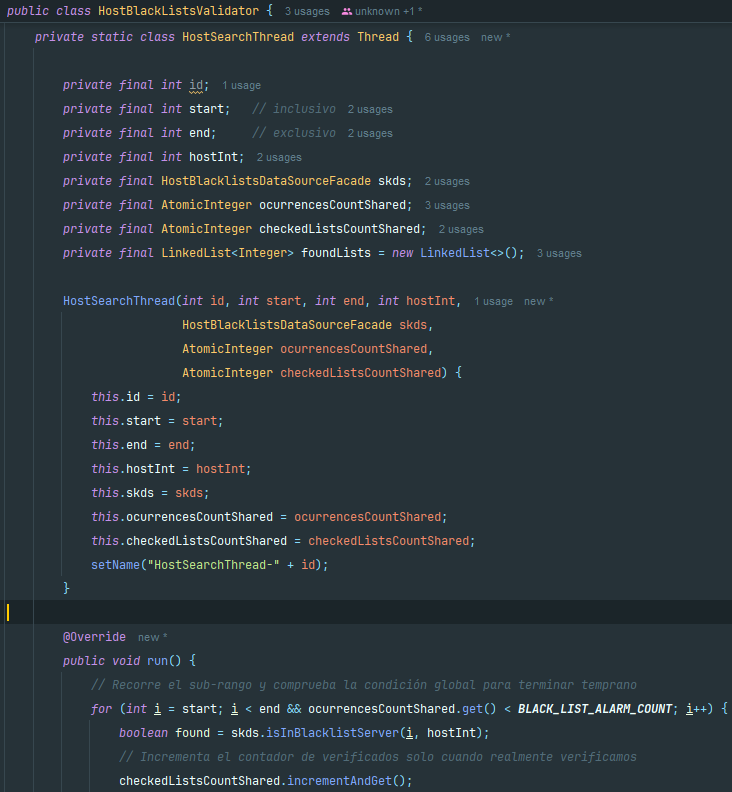
   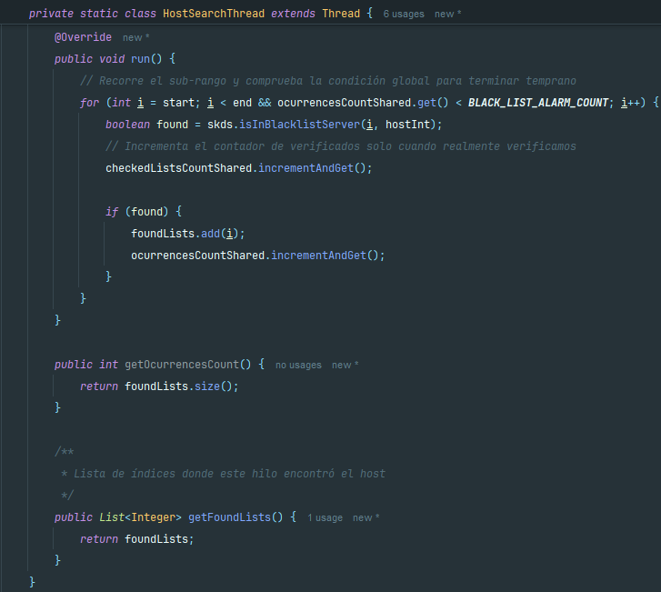
2. Agregue al método 'checkHost' un parámetro entero N, correspondiente al número de hilos entre los que se va a realizar la búsqueda (recuerde tener en cuenta si N es par o impar!). Modifique el código de este método para que divida el espacio de búsqueda entre las N partes indicadas, y paralelice la búsqueda a través de N hilos. Haga que dicha función espere hasta que los N hilos terminen de resolver su respectivo sub-problema, agregue las ocurrencias encontradas por cada hilo a la lista que retorna el método, y entonces calcule (sumando el total de ocurrencuas encontradas por cada hilo) si el número de ocurrencias es mayor o igual a BLACK_LIST_ALARM_COUNT. Si se da este caso, al final se DEBE reportar el host como confiable o no confiable, y mostrar el listado con los números de las listas negras respectivas. Para lograr este comportamiento de 'espera' revise el método join del API de concurrencia de Java. Tenga también en cuenta:
   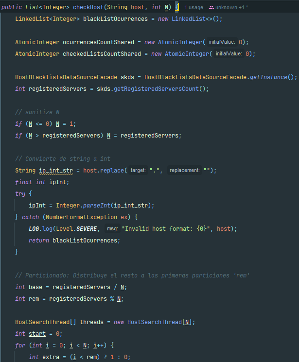
    - Dentro del método checkHost Se debe mantener el LOG que informa, antes de retornar el resultado, el número de listas negras revisadas VS. el número de listas negras total (línea 60). Se debe garantizar que dicha información sea verídica bajo el nuevo esquema de          procesamiento en paralelo planteado.
      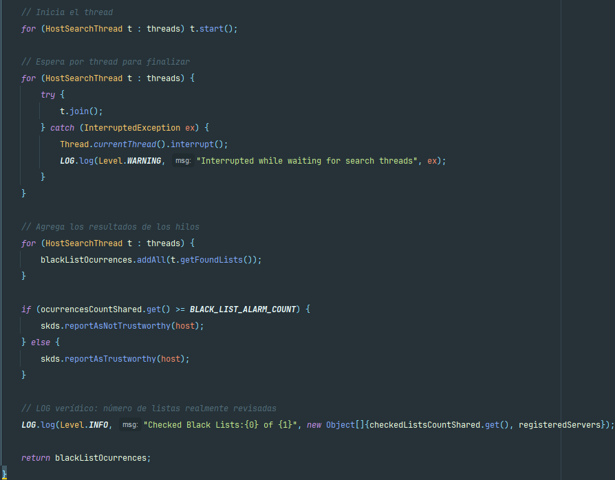
    - Se sabe que el HOST 202.24.34.55 está reportado en listas negras de una forma más dispersa, y que el host 212.24.24.55 NO está en ninguna lista negra.
      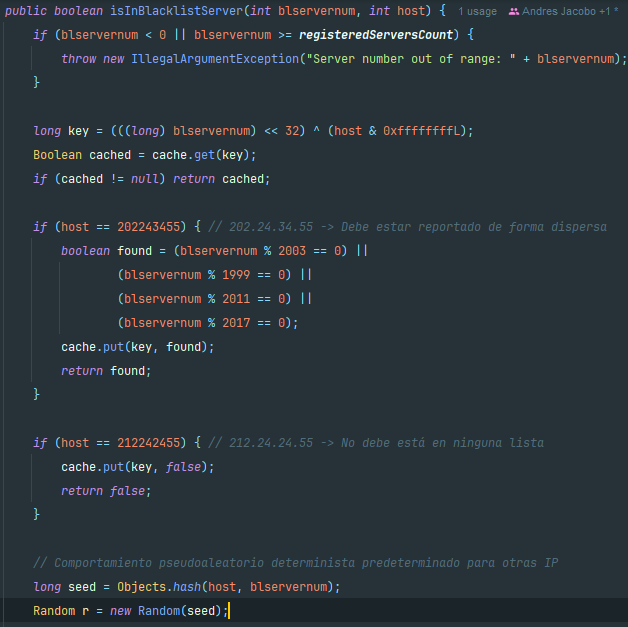

La estrategia de paralelismo antes implementada es ineficiente en ciertos casos, pues la búsqueda se sigue realizando aún cuando los N hilos (en su conjunto) ya hayan encontrado el número mínimo de ocurrencias requeridas para reportar al servidor como malicioso. Cómo se podría modificar la implementación para minimizar el número de consultas en estos casos?, qué elemento nuevo traería esto al problema?

Tras revisar el problema y comparar soluciones típicas en programación concurrente, propongo dos medidas combinadas que reducen significativamente las comprobaciones redundantes:
1. Señal de cancelación cooperativa (stop)

    - Introducir un AtomicBoolean stop compartido.

    - Cada hilo antes de iniciar una nueva verificación comprueba stop.get(). Si es true, el hilo sale.

    - Cuando cualquier hilo incrementa el contador global de ocurrencias y detecta que se alcanza el umbral (>= BLACK_LIST_ALARM_COUNT), hace stop.set(true).

    Así se impide que se inicien nuevas comprobaciones después de alcanzado el umbral.

2. Asignación de trabajo dinámica mediante un índice global (nextIndex)

    - En vez de particionar de forma estática, usar un AtomicInteger nextIndex que actúe como “cola ligera”: cada hilo hace i = nextIndex.getAndIncrement() para obtener la siguiente lista a chequear.

    - Mientras i < totalServers y !stop.get(), el hilo procesa i.

    De esta manera se evita que un hilo esté atascado con un sub-rango grande mientras otros ya terminaron; permite que el trabajo se consumA hasta que alguien active stop.

Al introducir estos cambios incorporamos cancelación cooperativa y planificación dinámica donde conseguimos:

- Necesidad de visibilidad y atomicidad: hay que usar variables atómicas (AtomicBoolean, AtomicInteger) o volatile para asegurar que todos los hilos vean la señal stop sin retrasos.

- Mayor coordinación entre hilos: ahora los hilos colaboran (cooperan) para dejar de trabajar en cuanto el conjunto ha alcanzado la meta. Esto añade una dependencia ligera (la señal stop) que antes no existía.

- Cambio de patrón de particionado: pasamos de partición estática a asignación dinámica, lo que altera cómo se razona sobre balance de carga y rendimiento.

- Posible falta de determinismo en orden de comprobaciones: al ser dinámica, las listas se chequean en orden “race” (quién hace getAndIncrement primero), por lo que la secuencia de comprobaciones puede variar entre ejecuciones; esto puede afectar pruebas que dependen del orden.

- Manejo de llamadas bloqueantes: si isInBlacklistServer puede bloquear largo tiempo, la cancelación cooperativa sólo evita nuevas comprobaciones; las llamadas en curso seguirán hasta terminar a menos que se implementen interrupciones/timeouts en esa función.

- Coste extra de sincronización atómica: las operaciones atómicas tienen un coste (pequeño), pero mucho menor que el ahorro al evitar consultas redundantes en escenarios realistas.

### Parte III - Evaluación de Desempeño

A partir de lo anterior, implemente la siguiente secuencia de experimentos para realizar las validación de direcciones IP dispersas (por ejemplo 202.24.34.55), tomando los tiempos de ejecución de los mismos (asegúrese de hacerlos en la misma máquina).
Al iniciar el programa ejecute el monitor jVisualVM, y a medida que corran las pruebas, revise y anote el consumo de CPU y de memoria en cada caso.

1. Un solo hilo.
   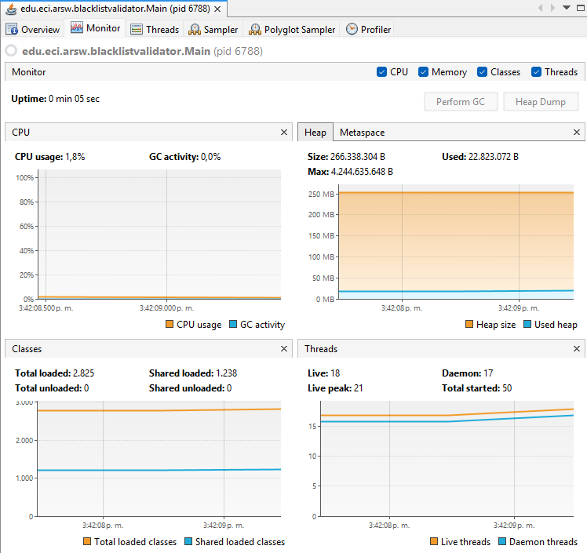

2. Tantos hilos como núcleos de procesamiento (haga que el programa determine esto haciendo uso del API Runtime).
   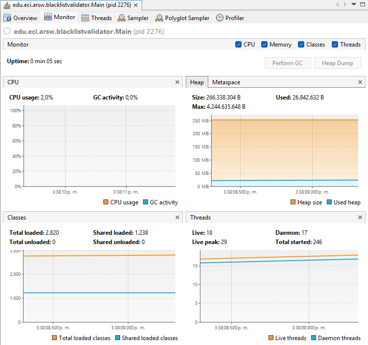
3. Tantos hilos como el doble de núcleos de procesamiento.
   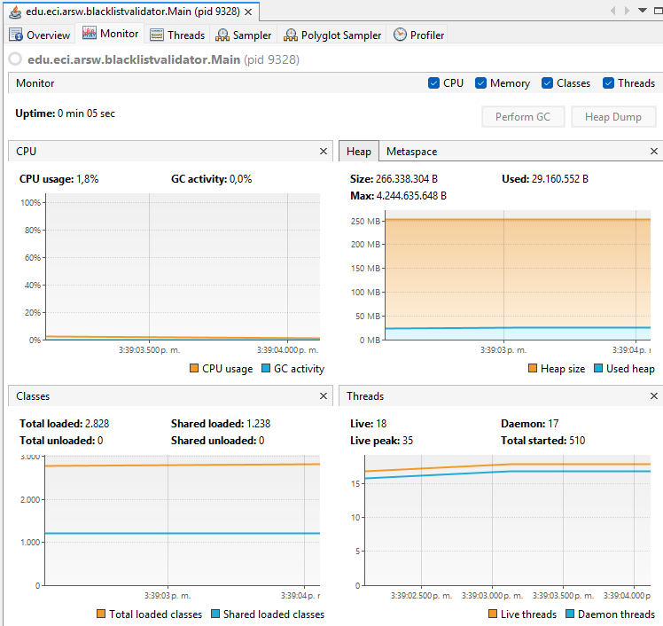
4. 50 hilos.
   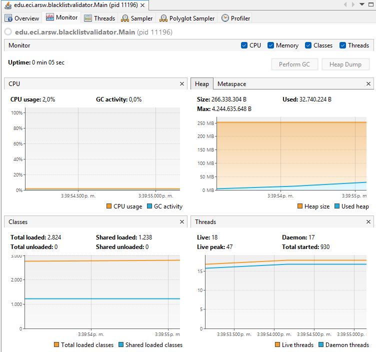
5. 100 hilos.
   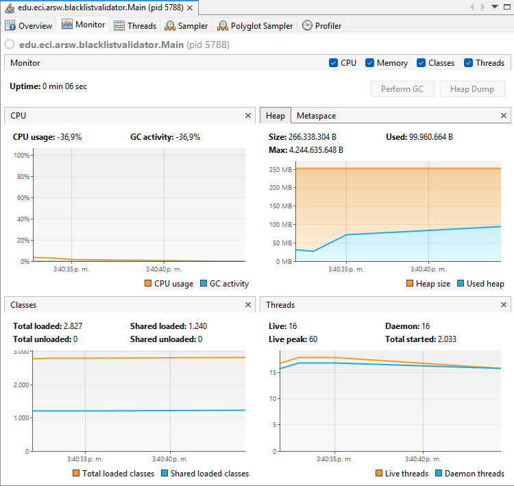

Con lo anterior, y con los tiempos de ejecución dados, haga una gráfica de tiempo de solución vs. número de hilos. Analice y plantee hipótesis con su compañero para las siguientes preguntas (puede tener en cuenta lo reportado por jVisualVM):

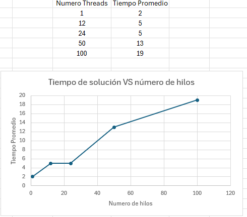

### Parte IV - Ejercicio Black List Search

1. Según la ley de Amdahls:

   
   
   donde S(n) es el mejoramiento teórico del desempeño, P la fracción paralelizable del algoritmo, y n el número de hilos, a mayor n, mayor debería ser dicha mejora. Por qué el mejor desempeño no se logra con los 500 hilos?, cómo se compara este desempeño cuando se usan 200?.

   Aunque Amdahl sugiere que al subir 𝑛 aumenta 𝑆(𝑛), en la práctica aparecen costos que la fórmula no modela:

   - Sobresuscripción: tengo 12 cores. Con 200 o 500 hilos, el SO está cambiando de contexto todo el tiempo; eso es tiempo muerto.

   - Contención/Sincronización: mi solución usa contadores atómicos compartidos y una condición global de paro; con muchísimos hilos esa contención se siente.

   - Carga pequeña + parada temprana: se detiene al encontrar 5 ocurrencias; muchos hilos “llegan tarde” y no aportan.

   - Caché/Memory bandwidth: más hilos peleando por el mismo bus y caché no ayuda.

   Por eso, al pasar de 50→100 hilos ya vi que el tiempo empeora (13→19 ms). Con 200 o 500, esperaría peor todavía. En resumen: más hilos ≠ más rápido cuando se excede (por mucho) el número de cores y la tarea es corta.
   
2. ¿Cómo se comporta la solución usando tantos hilos de procesamiento como núcleos comparado con el resultado de usar el doble de éste?.

   Con 12 hilos y 24 hilos me dio prácticamente lo mismo (5 ms):

   - Con ~núcleos, la CPU ya está llena.

   - Duplicar hilos no agrega capacidad, sólo overhead (planificador, colas, atómicos).

   - En problemas con parada temprana, la ganancia adicional es nula o incluso negativa.

   Esto cuadra con Amdahl: si 𝑃 < 1 y el tramo secuencial/overhead empieza a dominar, el speedup se estanca.

3. ¿De acuerdo con lo anterior, si para este problema en lugar de 100 hilos en una sola CPU se pudiera usar 1 hilo en cada una de 100 máquinas hipotéticas, la ley de Amdahls se aplicaría mejor?. Si en lugar de esto se usaran c hilos en 100/c máquinas distribuidas (siendo c es el número de núcleos de dichas máquinas), se mejoraría?. Explique su respuesta.

   - 100 hilos en 1 CPU: sobresuscripción severa → cambios de contexto y contención → resultados malos (lo vi con 100 hilos: 19 ms).
   - 1 hilo en 100 máquinas: cada hilo tendría su propio core. Eso suena ideal para Amdahl, peeeero aparece nuevo overhead (distribución del trabajo, coordinación del paro global, latencias de red, agregación de resultados, fallos).

      - Si el trabajo fuera grande y “embarrassingly parallel”, sí veríamos beneficios claros.

      - En mi caso (tarea corta, paro en 5 ocurrencias), ese overhead podría comerse buena parte del beneficio. No espero speedup lineal.

4.  ¿Si en lugar de esto se usaran c hilos en 100/c máquinas distribuidas (siendo c es el número de núcleos de dichas máquinas), se mejoraría?
    Esa configuración mantiene 1 hilo por core a nivel cluster (lo cual evita sobresuscripción local) y reparte memoria/caché entre nodos. Conceptualmente es mejor que 100 hilos comprimidos en una sola CPU. Pero Amdahl sigue mandando: el tramo no paralelizable + la coordinación distribuida (red, sincronización del umbral de 5 hallazgos, etc.) limitan el speedup.
    - Si el problema fuera mucho más grande, sí mejoraría respecto a 1 sola máquina.
    - Con carga pequeña como la de este laboratorio, la mejora sería modesta y no lineal.