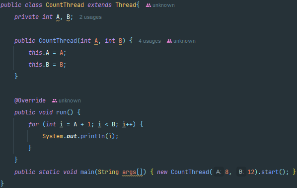
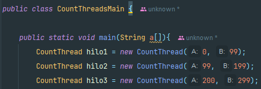
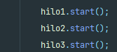
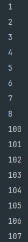
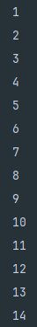

# Laboratorio 1 - Arquitecturas del Software (ARSW)
## Andrés Jacobo Sepúlveda Sánchez

**Descripción**

Este ejercicio contiene una introducción a la programación con hilos en Java, además de la aplicación a un caso concreto.

### Parte 1 Introducción a Hilos en Java

**1.** De acuerdo con lo revisado en las lecturas, complete las clases CountThread, para que las mismas definan el ciclo de vida de un hilo que imprima por pantalla los números entre A y B.

**2.1** Complete el método main de la clase CountMainThreads para que cree 3 hilos de tipo CountThread, asignándole al primero el intervalo [0..99], al segundo [99..199], y al tercero [200..299].

**2.2** Inicie los tres hilos con 'start()'

**2.3** Ejecute y revise la salida por pantalla.

**2.4**  Cambie el incio con 'start()' por 'run()'. Cómo cambia la salida?, por qué?.

Cuando cambiamos start() por run() la salida en este caso se muestra en orden. Esto se debe a que con run() no se ejecutan todos los hilos de forma paralela si no que se ejecuta de manera bloqueante, es decir, uno detras del otro lo que implica que hasta que el primer hilo no acabe el segundo no se va a ejecutar. 

### Parte 2 Ejercicio Black List Search
Para un software de vigilancia automática de seguridad informática se está desarrollando un componente encargado de validar las direcciones IP en varios miles de listas negras (de host maliciosos) conocidas, y reportar aquellas que existan en al menos cinco de dichas listas.

Dicho componente está diseñado de acuerdo con el siguiente diagrama, donde:

- HostBlackListsDataSourceFacade es una clase que ofrece una 'fachada' para realizar consultas en cualquiera de las N listas negras registradas (método 'isInBlacklistServer'), y que permite también hacer un reporte a una base de datos local de cuando una dirección IP se considera peligrosa. Esta clase NO ES MODIFICABLE, pero se sabe que es 'Thread-Safe'.

- HostBlackListsValidator es una clase que ofrece el método 'checkHost', el cual, a través de la clase 'HostBlackListDataSourceFacade', valida en cada una de las listas negras un host determinado. En dicho método está considerada la política de que al encontrarse un HOST en al menos cinco listas negras, el mismo será registrado como 'no confiable', o como 'confiable' en caso contrario. Adicionalmente, retornará la lista de los números de las 'listas negras' en donde se encontró registrado el HOST.

